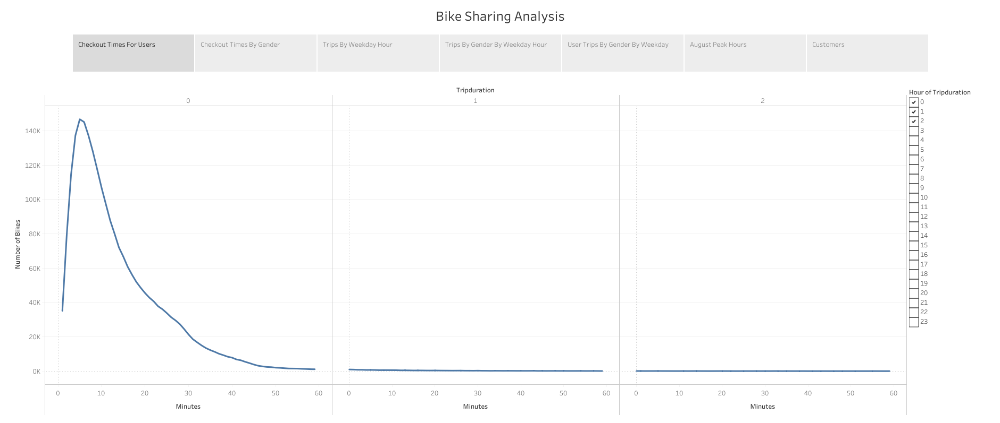
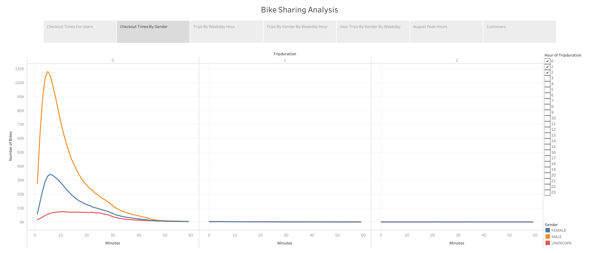
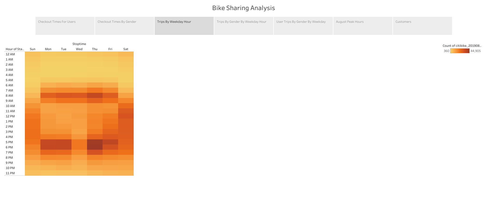
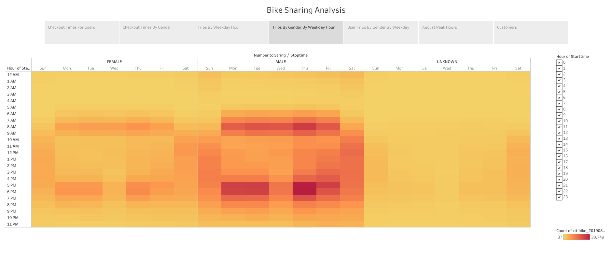
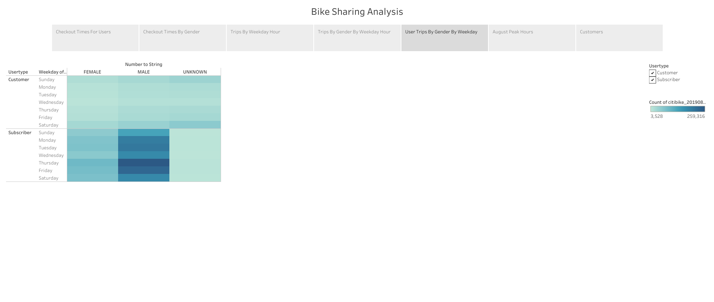
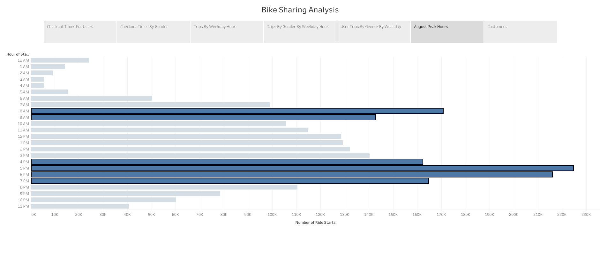
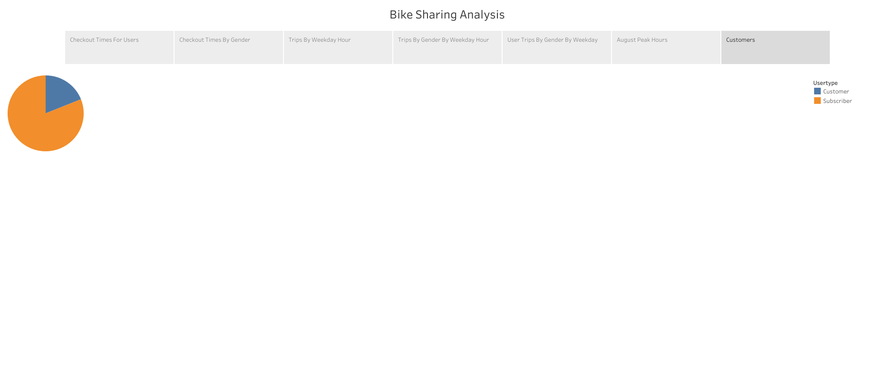

# Bikesharing
The story referenced in this project can be found [here](https://public.tableau.com/views/BikeSharingAnalysis_16459142363070/BikeSharingAnalysis?:language=en-US&publish=yes&:display_count=n&:origin=viz_share_link)
## Overview
The goal of this project was to analyze NYC bikesharing data from Citi Bike to understand if is a viable option for investors to invest in. The main things we hope to understand are:
- What is the customer base?
- When are the bikes most used?
## Results
This chart is a description of the trip duration in minutes. It shows that the bulk of rides that are done are generally under an hour in length.

This chart shows a breakdown of the first graph by gender. It allows us to see that there is a much higher proportion of males using the bikes compared to females, but it also shows that the general trend of ride duration remains the same. 

This graph shows a heatmap of use based on time, for when the bikes were being used. It is showing a strong trend of bikes being used during times when people are commuting to and from work. There are strong bands in the mornings and evenings during normal 'rush hour' times. We also see a wide spread on weekends for usage patterns.

This breakdown is a further breakdown of the previous graph which showed the time heatmap based on gender. Although lighter, female and male patterns seem to be the same in usage times. The lightness is the same as was explained in the checkout time by gender graph.

This graph is a breakdown by day and gender as to if the user is a subscriber and when they use the bikes. It shows that most users are subscribers using the bikes mainly on weekdays. This is consistent as to what we have seen up to this point. The main point of this graph is to look at the customers. Users who are not subscribers tend to use the bikes on weekends which is an interesting point to note.

This graph shows the number of rides that were taken and at what time. This again lines up with the heatmaps that we saw in that the main times of use are during traditional rush hour times for uses of commuting.

This graph is a breakdown of percentage of users that are subscribers, and we can see that a bulk of the users are subscribers who will use the service on a regular basis.

## Summary
To summarize, mainly users are subscribers to the program, who tend to use the bikes as a means of commute. They are using the bikes at normal rush hour times for, on average, under one hour. The non subscribers tend to use the bikes on the weekends. 
